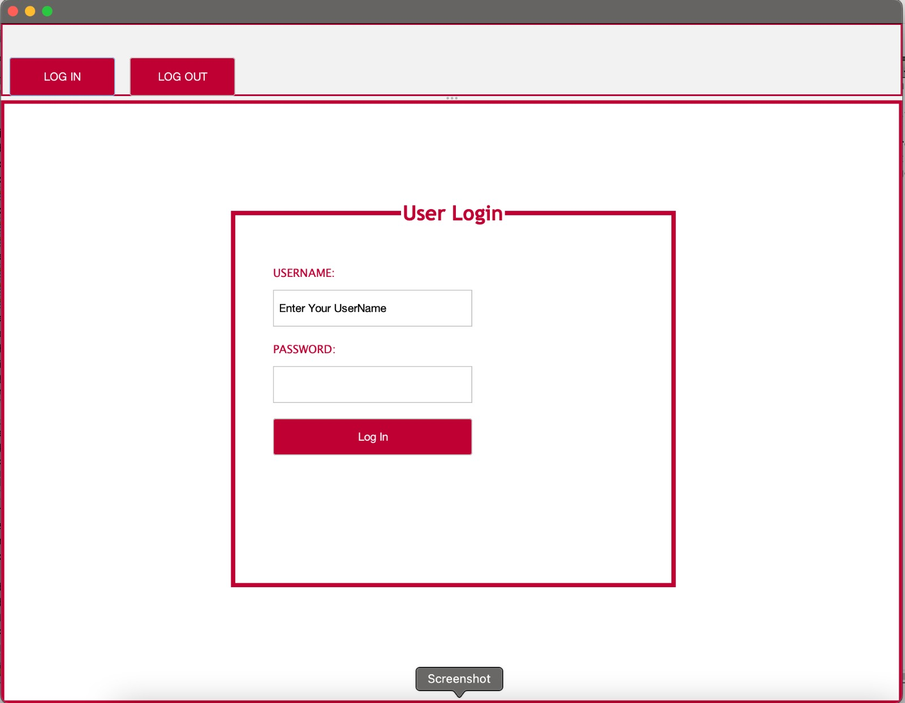
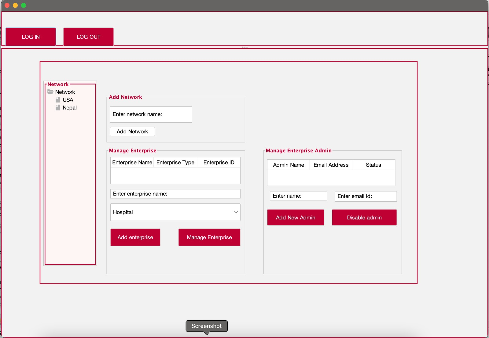

# INFO 5100 Final Project

## Participants
- Anjali Jain (002958076)
- Bhavin Bhatia (002981075)
- Stuti Singh (002953126)

## Description
Health-care management system application designed to solve the needs of the healthcare ecosystem and the enterprises that interact in this ecosystem such as hospitals, pharmacies, insurance companies, blood banks etc.

## Technology
- Java
- Java Swing
- NetBeans IDE
- Git (Version Control)

## How to run
1. Install Java with JDK 1.8 and your preferred IDE for Java
2. Clone the project
3. Open the project in your IDE and run

## Example Screenshots

